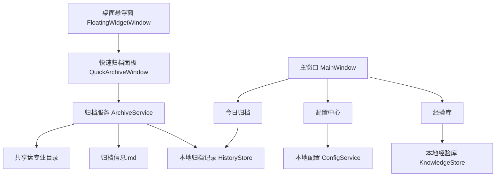

# ClueVault v2 技术架构决策

## 1. 结论

正式 MVP 推荐继续走 `WPF / .NET 8` 主线，不回到 Electron，也不采用混合架构。

当前产品的关键能力是 Windows 桌面置顶悬浮窗、桌面文件拖拽、共享盘写入、截图辅助和本地轻量配置。这些能力更接近 Windows 原生桌面工具，而不是跨平台 Web 应用。WPF 的实现复杂度、运行体积、文件系统稳定性和长期维护成本更符合当前目标。

Electron 原型保留在 `code/electron-prototype/`，只作为交互和历史代码参考，不再作为正式 MVP 主线。

## 2. 决策背景

PRD v2 已经把核心场景收敛为：

- 运营在微信群收到用户模型。
- 把文件拖到桌面悬浮窗。
- 弹出独立快速归档小面板。
- 选择专业。
- 归档到共享盘对应专业目录。
- 自动生成轻量 `归档信息.md`。
- 今日记录可回看，可补备注并同步回归档目录。

这不是一个需要复杂页面路由、多人协作后台或跨平台发布的产品。它首先是一个 Windows 桌面效率工具。

## 3. 方案比较

| 维度 | WPF / .NET 8 | Electron / React | 混合方案 |
| --- | --- | --- | --- |
| Windows 置顶悬浮窗 | 原生支持，窗口透明、置顶、拖动、拖放都直接 | 可实现，但透明窗口、拖放和焦点行为更容易有边界问题 | 可实现，但两套窗口模型复杂 |
| 桌面拖拽 | WPF `AllowDrop` 和文件路径处理直接 | Electron 可做，但依赖 Chromium / IPC | 需要跨进程转发 |
| 共享盘写入 | .NET `System.IO` 简洁稳定 | Node `fs` 可用，但打包和权限问题更多 | 复杂度最高 |
| 截图辅助 | 可走 Windows API / .NET 库逐步实现 | Electron 截屏能力强，但要处理授权、窗口层级 | 需要跨端桥接 |
| 打包分发 | 单体 Windows 桌面工具更轻 | 体积大，依赖 Chromium | 最重 |
| UI 迭代效率 | XAML 稍慢，但当前界面简单 | React 更快 | 界面快但架构重 |
| AI / 经验库 | .NET 调用 HTTP API 足够 | Node 调 API 也方便 | 无明显收益 |
| 维护成本 | 一套技术栈，适合当前团队 | 前后端 + Electron 主进程维护更多 | 不建议 |

## 4. 推荐架构



### 4.1 桌面窗口层

- `FloatingWidgetWindow`：透明、置顶、只显示卡通形象，作为拖拽入口。
- `QuickArchiveWindow`：拖入文件后弹出的独立小面板，不打开主窗口。
- `MainWindow`：配置、今日归档、经验库，不作为日常归档主路径。

### 4.2 服务层

- `ConfigService`：管理姓名、共享盘根目录、专业列表、截图开关、悬浮窗设置。
- `ArchiveService`：校验共享盘、创建目录、复制文件、写入 `归档信息.md`。
- `HistoryService`：保存本地归档记录，支持补备注后同步写回 `归档信息.md`。
- `StatsService`：统计当日归档数，驱动蛙弟 / 蜂哥自动切换。
- `KnowledgeService`：后续独立经验库能力，不进入模型归档主流程。

### 4.3 数据存储

MVP 先使用本地 JSON 文件，不引入数据库：

- `%LOCALAPPDATA%\ClueVaultDesktop\config.json`
- `%LOCALAPPDATA%\ClueVaultDesktop\archive-history.json`
- `%LOCALAPPDATA%\ClueVaultDesktop\archive-stats.json`
- `%LOCALAPPDATA%\ClueVaultDesktop\knowledge-base.json`

原因：

- 当前数据量小。
- 不需要多人实时协作。
- JSON 易排查、易备份、易迁移。
- 以后如果经验库需要团队共享，再单独升级存储方案。

## 5. 正式 MVP 输出结构

共享盘建议结构：

```text
共享盘根目录/
  建筑/
    2026-05-28_微信群_张三_153012/
      user-model.rvt
      chat-screenshot.png
      归档信息.md
  结构/
  给排水/
  暖通/
  电气/
  其他/
```

`归档信息.md` 最低内容：

```markdown
# 用户模型归档

- 归档时间:
- 归档人:
- 来源: 微信群
- 专业:
- 项目名:
- 备注:

## 文件清单

- model.rvt
- chat-screenshot.png
```

## 6. 第一轮不做

- 不做完整 bug 问题单。
- 不要求问题描述。
- 不做 AI 主流程。
- 不做团队经验库同步。
- 不做测试组状态回写。
- 不做 Electron / WPF 双线维护。

## 7. 风险与处理

| 风险 | 处理 |
| --- | --- |
| 当前蛙弟 / 蜂哥图片不是透明底 | 正式悬浮窗需要重新导出透明 PNG / WebP；代码层保持透明窗口 |
| 微信拖出的文件路径不稳定 | 第一轮重点验证微信桌面版拖拽行为；失败时保留手动添加文件入口 |
| 共享盘权限不稳定 | 归档前做可写校验；失败时不清空待归档文件 |
| 截图功能实现复杂 | 截图作为可选能力；第一轮先完成文件归档主链路 |
| 备注同步误覆盖 | 只重写本工具生成的 `归档信息.md`，不修改用户原始文件 |

## 8. 执行原则

- 先改 WPF 主线。
- Electron 代码只读参考，不继续投入。
- 每次开发优先保证“拖入、选专业、归档、记录”可用。
- 主窗口功能不能反向拖慢悬浮窗极速路径。
- AI 和经验库不进入第一轮归档链路。

