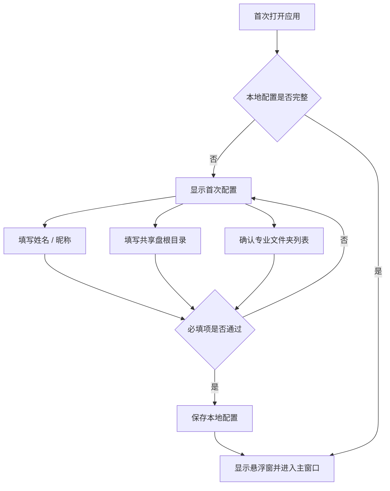
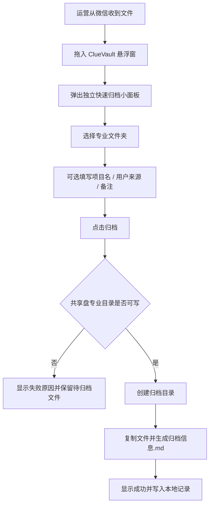
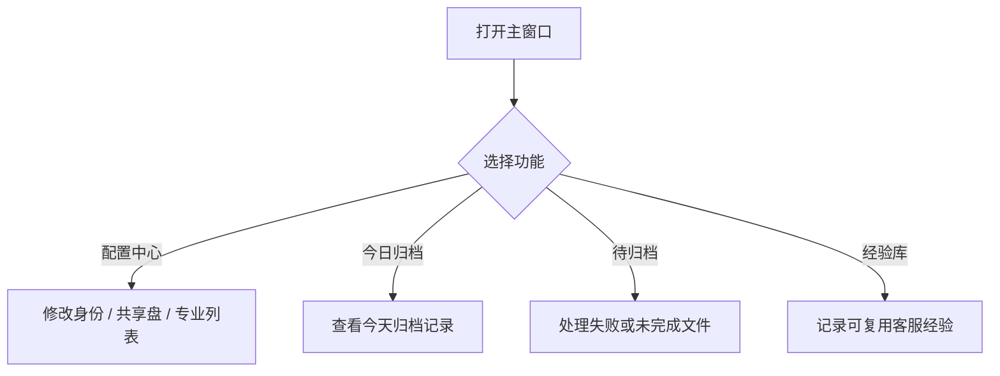

# ClueVault PRD v2

## 1. 产品定位

ClueVault 是一个面向 Windows 桌面环境的“用户模型极速归档工具”。当前最重要的任务不是让运营写清楚 bug，而是让运营在微信里收到用户模型后，能用最少动作把文件归档到共享盘对应专业文件夹，交给测试组继续验证。

当前阶段的核心判断：

- 测试组明确需要的是“收到的用户模型文件”，不是完整问题单。
- 运营每天客串客服，主流程必须足够轻。
- 问题描述、AI 摘要都不进入当前主流程。
- 悬浮窗应成为日常主入口，主窗口主要承担配置、记录、备注维护和经验库管理。
- 经验库是独立能力，不绑定模型归档；有空或遇到高价值回复时再快速记录。

## 2. 真实用户与场景

### 2.1 运营 / 客服

典型场景：

- 在微信群里维护用户。
- 用户发来模型文件、压缩包、截图或补充材料。
- 运营需要顺手把材料放到共享盘，让测试组后续测试。
- 运营不一定有时间描述清楚问题。

核心诉求：

- 文件拖一下就能归档。
- 只做必要选择，例如归档到哪个专业。
- 备注、项目名、用户信息都应可选。
- 归档完成后能看到今天自己归档了哪些文件。
- 归档后如果发现备注不准确，可以从今日归档记录里修改，并同步到该归档目录的 `归档信息.md`。
- 经验记录应单独入口处理，不要混在提交模型时。

### 2.2 测试组

典型场景：

- 从共享盘按专业目录查看用户提交的模型。
- 取模型后自行测试、复现、判断问题。

核心诉求：

- 文件能稳定进入正确专业目录。
- 文件夹命名能看出日期、提交人和来源线索。
- 如果运营有备注，可以看到；没有备注也不影响接收。

### 2.3 管理者 / 实施同事

典型工作：

- 配置共享盘根目录。
- 配置专业文件夹列表。
- 分发工具给运营。

核心诉求：

- 专业分类可维护。
- 多人使用时输出结构稳定。
- 工具不依赖登录系统或复杂后台。

## 3. MVP 范围

### 3.1 v2 MVP 必须包含

- 首次配置：姓名 / 昵称、共享盘根目录。
- 专业文件夹配置：建筑、结构、给排水、暖通、电气、其他，支持后续修改。
- 悬浮窗拖入文件。
- 拖入后弹出独立快速归档小面板，不打开主面板。
- 快速归档面板支持选择专业。
- 专业选择不使用下拉框，直接显示全部专业按钮，点击即可选中。
- 默认只显示待归档文件和专业点选。
- 项目名、用户来源、备注放入折叠的“更多信息”。
- 用户来源默认 `微信群`。
- 设置中可开启“拖入后截图”。开启后，拖入文件后先提示框选聊天截图，截图会作为附件一并归档。
- 点击归档后复制文件到共享盘对应专业目录。
- 自动生成轻量 `归档信息.md`。
- 归档成功 / 失败反馈。
- 本地保留当天归档记录。
- 今日归档记录支持重新修改备注，并同步到对应归档目录的 `归档信息.md`。
- 主窗口提供配置中心、归档记录和经验库，不承担日常归档主路径。
- 经验库支持快速记录可复用客服经验草稿。

### 3.2 v2 MVP 不强制包含

- 问题描述必填。
- AI 草稿生成。
- 完整 `说明.md`。
- 复杂问题单工作台。
- 自动识别模型内容。
- 自动判断 bug 类型。
- 团队经验库共享。

### 3.3 可延后

- 截图 OCR 或聊天截图辅助总结。
- 团队共享经验库。
- 提交历史检索。
- 测试组处理状态回写。
- Jira、禅道、飞书多维表对接。

## 4. 核心流程

### 4.1 首次配置流程



失败处理：

- 姓名 / 昵称为空：不能完成初始化。
- 共享盘根目录为空：不能完成初始化。
- 共享盘暂时不可访问：允许保存但标记为未验证，归档前必须再次校验。

### 4.2 悬浮窗极速归档流程



主流程原则：

- 专业是唯一必选业务字段。
- 项目名、用户来源、备注都可空。
- 默认不显示项目名、用户来源、备注；需要时用户手动展开“更多信息”。
- 不要求运营描述问题。
- 不要求 AI 生成。
- 归档失败时必须保留当前待归档文件，方便重试。

### 4.3 主窗口管理流程



当前 MVP 中，主窗口不是日常归档主路径。日常归档应尽量从悬浮窗完成。

## 5. 页面与状态

### 5.1 悬浮窗

目的：常驻桌面，接收拖入文件，触发快速归档。

正式要求：

- 必须是 Windows 桌面置顶窗口，而不是主窗口内部控件。
- 支持拖动位置。
- 支持展开 / 收起。
- 收起后仍能作为拖拽目标。
- 支持从微信、资源管理器等位置直接拖入文件。
- 拖入文件后弹出独立快速归档小面板，不打开主窗口。
- 如已开启截图辅助，弹出小面板后先进入截图步骤，允许框选微信群聊天反馈截图。
- 收起态只显示卡通角色，不显示工具条。
- 收起态背景必须透明；正式素材应使用透明底 PNG / WebP，避免出现矩形底。
- 鼠标悬停不展开，避免影响运营当前工作。
- 点击角色可以展开状态信息；拖入文件直接触发归档流程。
- 支持蛙弟 / 蜂哥两种形象，达到当日归档阈值后自动从蛙弟切换为蜂哥。
- 预留拖入文件时的“张开大口”状态，用于后续动效或替换素材。

状态：

- 待命状态。
- 收起角色状态。
- 点击展开状态。
- 拖拽悬停状态。
- 拖入大口状态，当前作为后续能力预留。
- 接收文件状态。
- 归档成功后的短暂反馈。
- 当日归档数量提醒。

### 5.2 快速归档面板

目的：用最少输入完成归档。它是独立小面板，不是主窗口，也不应接近主窗口尺寸。

字段：

- 待归档文件列表：自动带入。
- 聊天截图：可选，开启截图辅助后自动提示框选。
- 专业：必选，直接展示全部专业小标签，点击选中，避免占用过多小面板空间。
- 更多信息：默认折叠，包含项目名、用户来源、备注。
- 项目名：可选，默认空。
- 用户来源：可选，默认 `微信群`。
- 备注：可选，默认空。

状态：

- 未选择专业。
- 共享盘校验中。
- 归档中。
- 归档成功。
- 归档失败。

### 5.3 首次配置

目的：完成最小可用配置。

字段：

- 姓名 / 昵称。
- 共享盘根目录。
- 专业文件夹列表。

### 5.4 配置中心

目的：修改本地身份、共享盘和专业分类。

模块：

- 个人身份。
- 共享盘根目录。
- 专业文件夹列表。
- 悬浮窗开关。

### 5.5 今日归档记录

目的：让运营回看今天交给测试组的文件。

信息：

- 归档时间。
- 专业。
- 目录名。
- 文件数量。
- 项目名。
- 用户来源。
- 备注。
- 归档状态。

能力：

- 支持修改备注。
- 修改后同步更新对应归档目录中的 `归档信息.md`。
- 同步失败时提示原因，保留本地修改草稿。

### 5.6 经验库

目的：单独沉淀可复用客服回复经验，不和模型归档绑定。

建议形态：

- 主菜单中独立显示 `经验库`。
- 支持快速填写关键词、适用场景、回复经验。
- 初期只保存为草稿，不做搜索、推荐、审核和团队协作。
- 截图辅助、OCR、AI 总结等能力后续再评估。

## 6. 字段与规则

### 6.1 配置字段

| 字段 | 必填 | 默认值 | 规则 |
| --- | --- | --- | --- |
| 姓名 / 昵称 | 是 | 无 | 用于归档信息和目录命名 |
| 共享盘根目录 | 是 | 空 | 归档前必须存在且可写 |
| 专业文件夹 | 是 | 建筑、结构、给排水、暖通、电气、其他 | 可在配置中心修改 |
| 悬浮窗开关 | 否 | 开启 | 控制是否显示桌面入口 |
| 当日切换阈值 | 否 | 1 | 当日归档达到阈值后，悬浮窗从蛙弟切换为蜂哥 |
| 悬浮窗形象 | 否 | 自动 | 默认蛙弟，达到阈值后自动蜂哥 |
| 拖入后截图 | 否 | 关闭 | 开启后拖入文件会提示框选聊天截图并一并归档 |

### 6.2 快速归档字段

| 字段 | 必填 | 规则 |
| --- | --- | --- |
| 待归档文件 | 是 | 来自拖拽或手动添加 |
| 聊天截图 | 否 | 开启截图辅助后由用户框选生成，作为附件归档 |
| 专业 | 是 | 归档到共享盘对应专业目录，使用紧凑标签点选 |
| 项目名 | 否 | 用于目录命名，默认空，收在更多信息里 |
| 用户来源 | 否 | 默认微信群，收在更多信息里 |
| 备注 | 否 | 可记录用户一句话说明，默认空，收在更多信息里 |

### 6.3 共享盘目录结构

推荐结构：

```text
共享盘根目录/
  建筑/
  结构/
  给排水/
  暖通/
  电气/
  其他/
```

归档目录命名：

- 有项目名：`YYYY-MM-DD_HHMM_提交人_项目名`
- 无项目名：`YYYY-MM-DD_HHMM_提交人_用户模型`
- 如目录重名：追加 `_2`、`_3`，不覆盖已有目录。

### 6.4 归档目录内容

每次归档创建一个独立目录：

```text
共享盘根目录/
  建筑/
    2026-05-27_2310_张三_某项目/
      原始模型文件.rvt
      聊天截图.png
      归档信息.md
```

`归档信息.md` 至少包含：

- 归档时间。
- 提交人。
- 专业。
- 项目名。
- 用户来源。
- 备注。
- 文件清单。
- 是否包含聊天截图。

### 6.5 校验规则

- 未选择专业：不能归档。
- 没有待归档文件：不能归档。
- 共享盘根目录不可访问：不能归档。
- 专业目录不存在：可提示创建；MVP 默认自动创建。
- 文件复制失败：归档失败，显示失败文件名。
- 失败后不清空待归档文件。

## 7. AI 与经验沉淀边界

### 7.1 当前 MVP 不引入 AI 主流程

理由：

- 当前测试组需求是拿到模型，不是拿到 AI 分析。
- AI 会增加配置、失败处理和用户理解成本。
- 运营最需要的是减少动作。

### 7.2 经验库作为独立能力

经验沉淀有价值，但属于第二条业务线：把客服回复沉淀为团队可复用知识。

现阶段处理策略：

- 不进入极速归档必经流程。
- 在主菜单中独立提供 `经验库`。
- 初期只做“草稿记录”，不做搜索、推荐、审核和知识库协作。
- 截图辅助、OCR、AI 总结等能力放到后续评估。

## 8. Markdown 线稿

### 8.1 悬浮窗待命

```text
+------------------------+
| ClueVault              |
| 置顶                   |
| 待命中                 |
|                        |
| 拖入模型快速归档       |
| 今日已归档：3          |
+------------------------+
```

形象规则：

- 默认形象：蛙弟。
- 阈值后形象：蜂哥。
- 当前资产：`frogdi-confused-final.png`、`ebee-angry-final.png`。
- 当前资产如为非透明底，需要重新导出透明底版本后用于正式悬浮窗。
- 当前不通过悬停展开。
- 点击可展开状态信息。
- 拖入文件时预留“张开大口”表现，可用新素材或动效实现。
- 后续允许在配置中心替换或扩展形象素材，但 v2 MVP 先使用蛙弟 / 蜂哥。

收起态：

```text
+----------+
|  蛙弟    |
+----------+
```

达到阈值后：

```text
+----------+
|  蜂哥    |
+----------+
```

拖入悬停预留态：

```text
+----------+
| 张口形象 |
+----------+
```

### 8.2 悬浮窗拖拽悬停

```text
+------------------------+
| 松开鼠标               |
| 添加到待归档文件       |
|                        |
| 支持模型 / 压缩包 / 图 |
+------------------------+
```

### 8.3 独立快速归档小面板

```text
+--------------------------------+
| 快速归档                [关闭] |
+--------------------------------+
| 待归档文件                     |
| - user-model.rvt               |
|                                |
| 截图辅助：待框选 / 已添加      |
| [ 框选聊天截图 ]               |
|                                |
| 归档专业 *                     |
| [建筑] [结构] [给排水] [暖通]  |
| [电气] [其他]                  |
|                                |
| > 更多信息（可不填）           |
|                                |
| [      归档到共享盘      ] [配置] |
+--------------------------------+
```

状态说明：

- 未选择专业时，“归档到共享盘”禁用。
- 未拖入文件时，“归档到共享盘”禁用。
- 专业选择使用紧凑标签，不使用大按钮网格。
- “归档到共享盘”是底部主按钮，视觉优先级高于配置入口。
- 归档中显示加载状态。
- 归档失败保留面板和文件列表。
- 归档成功后显示结果，并允许继续归档下一批。
- 项目名、用户来源、备注默认不展示，展开“更多信息”后才显示。
- 截图辅助开启后，小面板默认显示截图步骤；未截图也允许跳过并继续归档。

### 8.4 归档成功

```text
+------------------------------------------------------+
| 归档成功                                             |
+------------------------------------------------------+
| 专业：建筑                                           |
| 目录：2026-05-27_2310_张三_某项目                    |
| 位置：\\server\share\建筑\2026-05-27_2310_张三_某项目 |
| 文件数量：2                                          |
| 归档信息：已生成                                     |
|                                                      |
| [ 打开目录 ] [ 继续归档 ]                            |
+------------------------------------------------------+
```

### 8.5 归档失败

```text
+------------------------------------------------------+
| 归档失败                                             |
+------------------------------------------------------+
| 原因：共享盘不可写                                   |
| 建议：检查网络、权限，或到配置中心更换共享盘根目录   |
| 待归档文件：已保留                                   |
|                                                      |
| [ 重新归档 ] [ 打开配置中心 ]                        |
+------------------------------------------------------+
```

### 8.6 配置中心

```text
+------------------------------------------------------+
| 配置中心                                      [ 返回 ] |
+----------------------+-------------------------------+
| 个人身份             | 姓名 / 昵称                   |
| 共享盘               | [ 张三                       ] |
| 专业文件夹           |                               |
| 悬浮窗               | 共享盘根目录                  |
|                      | [ \\server\share             ] |
|                      | [ 校验 ]                      |
|                      |                               |
|                      | 专业文件夹                    |
|                      | [ 建筑 ] [ 结构 ] [ 给排水 ] |
|                      | [ 暖通 ] [ 电气 ] [ 其他 ]   |
|                      | [ + 新增专业 ]                |
|                      |                               |
|                      | [x] 启用悬浮窗                |
|                      | [ 保存设置 ]                  |
+----------------------+-------------------------------+
```

### 8.7 今日归档记录

```text
+----------------------------------------------------------------+
| 今日归档记录                                            [ 刷新 ] |
+----------------------------------------------------------------+
| 时间   | 专业 | 项目名 | 用户来源 | 备注 | 文件数 | 状态 | 操作 |
| 09:20 | 建筑 | A项目  | 微信群1  | ...  | 2      | 成功 | 改备注 |
| 11:05 | 电气 |        | 用户B    | ...  | 1      | 成功 | 改备注 |
| 14:18 | 结构 | C项目  | 微信群2  | ...  | 3      | 失败 | 继续处理 |
+----------------------------------------------------------------+
```

### 8.8 经验库

```text
+------------------------------------------------------+
| 经验库                                               |
+------------------------------------------------------+
| 关键词                                               |
| [ 模型打开异常                                      ] |
|                                                      |
| 适用场景                                             |
| [ 用户反馈模型打开或显示不正常                      ] |
|                                                      |
| 回复经验                                             |
| [ 先收集模型文件、软件版本、截图...                 ] |
|                                                      |
| [ 保存经验 ] [ 清空 ]                                |
+------------------------------------------------------+
```

## 9. Demo 验收标准

Demo 类型：一次性静态流程样机。

必须可验证：

- 首页直接进入工具界面，不出现营销页。
- 能完成首次配置。
- 能通过悬浮窗模拟拖入文件。
- 拖入后弹出独立快速归档小面板，不打开主窗口。
- 能在配置中开启 / 关闭拖入后截图。
- 开启后，拖入文件会提示框选聊天截图。
- 框选完成后，截图作为附件计入归档文件。
- 能选择专业。
- 专业以全部按钮形式展示，不使用下拉框。
- 专业按钮应紧凑，不显著增大小面板高度。
- 默认不显示项目名、用户来源、备注。
- 用户来源默认微信群。
- 未选择专业时不能归档。
- 能可选填写项目名、用户来源、备注。
- 能模拟归档成功，展示专业、目录名、共享盘位置、文件数量。
- 能模拟共享盘不可写，展示失败原因并保留待归档文件。
- 能查看今日归档记录。
- 能在今日归档记录中修改备注，并模拟同步到归档目录的 `归档信息.md`。
- 能从主菜单进入经验库，快速保存一条经验草稿。

明确不验证：

- 真实文件复制。
- 真实共享盘写入。
- 真实 Windows 悬浮窗能力。
- AI 总结。
- 截图 OCR。
- 团队经验库共享。
- 最终技术架构。

## 10. 技术架构决策

PRD v2 和流程 Demo 完成后，技术架构已进入正式决策阶段。当前结论见 `docs/architecture-decision-v2.md`：正式 MVP 推荐继续走 `WPF / .NET 8` 主线，Electron 原型保留为参考，不再作为正式实现方向。

原评估对象：

- WPF。
- Electron。
- WPF + WebView / 混合方案。

已评估维度：

| 维度 | 需要判断的问题 |
| --- | --- |
| Windows 集成 | 悬浮窗、拖拽、文件系统、共享盘是否稳定 |
| 打包分发 | 非技术同事安装是否简单 |
| UI 迭代效率 | 快速归档面板和记录页修改是否高效 |
| 文件操作 | 大模型文件复制、重名处理、失败恢复是否可靠 |
| 安全性 | 本地配置和日志是否避免泄露共享盘敏感信息 |
| 可维护性 | 后续由谁维护，团队更熟悉哪套技术 |
| 测试成本 | 拖拽、文件复制、共享盘异常是否易测 |

当前执行决策：

- 不立即继续扩展原完整 bug 工单流程。
- 不立即引入 AI 主流程。
- 先验证“悬浮窗极速归档到专业文件夹”。
- 正式 MVP 从 `code/ClueVault.Desktop/` 的 WPF 主线继续开发。
- `code/electron-prototype/` 只保留作历史参考。

## 11. 验收标准

- 运营收到用户模型后，可以在 3 个关键动作内完成归档：拖入、选专业、点击归档。
- 问题描述不是必填项。
- 共享盘按专业分类输出目录。
- 归档失败不会丢失待归档文件。
- 今日归档记录能帮助运营回看自己提交过什么，并允许后续修改备注。
- 经验库是独立菜单，不干扰模型归档主流程。
- 悬浮窗形象支持蛙弟 / 蜂哥切换，后续可替换为正式设计稿。
- 蛙弟 / 蜂哥切换由当日归档阈值自动触发，不依赖鼠标悬停。
- 鼠标悬停不展开悬浮窗。
- 拖入文件时预留“张开大口”的视觉状态。
- 截图辅助可选开启，不影响不截图的极速归档路径。
